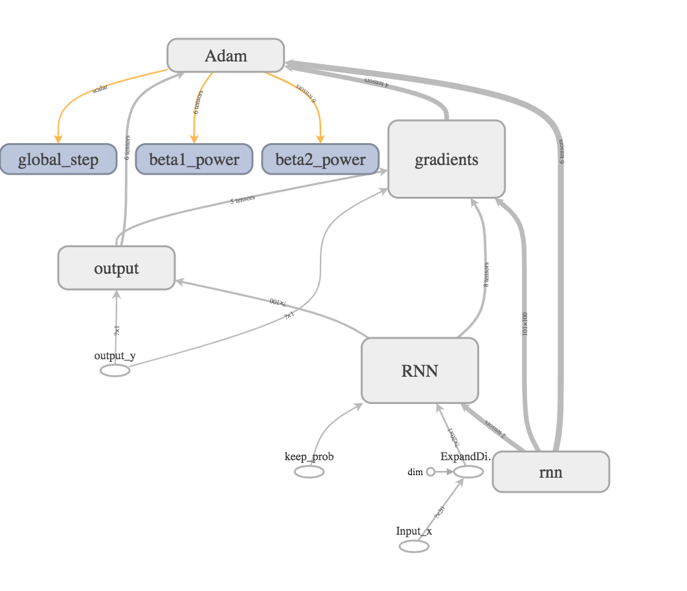
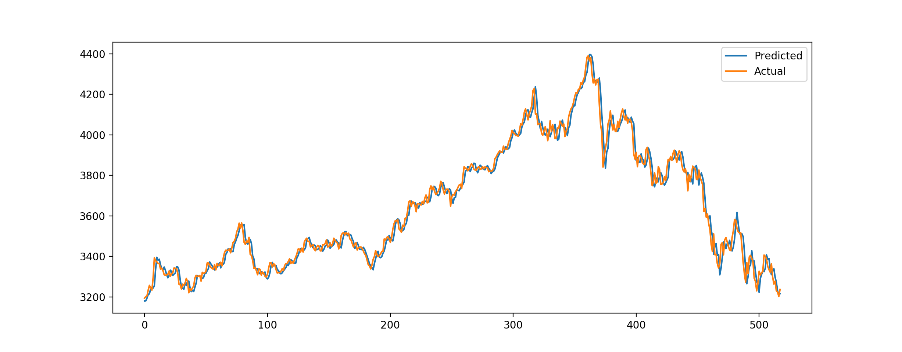
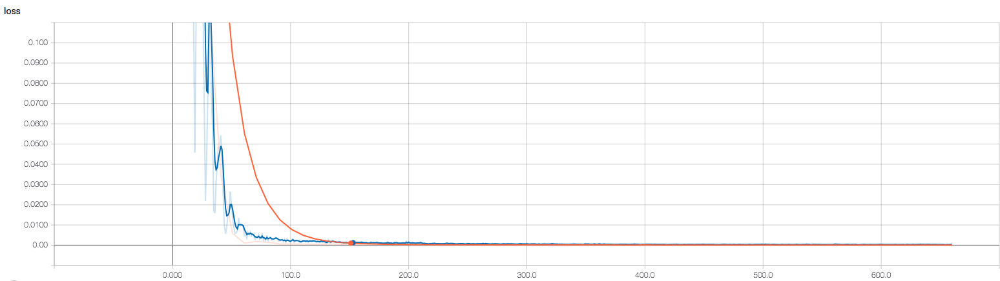

# RNN-Time-Series-tf

Apply Vanilla RNN cell to learn time-series sequence.
Data source is Shanghai Shenzhen Index 300. (CSI 300)



## Instruction
```{bash}
$ python train.py
```

## Conclusion


## I'll update this later